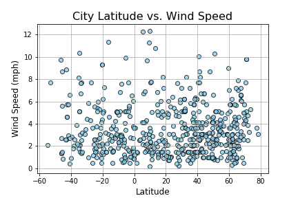

# Python API: What's the Weather Like?

## WeatherPy

The objective is to write a Python script to visualize the weather of 500+ cities across the world of varying distance from the equator using CityPy, a simple Python library, and the OpenWeatherMap API.

The visualizations includce a series of scatter plots to showcase the following relationships:

Temperature (F) vs. Latitude Humidity (%) vs. Latitude Cloudiness (%) vs. Latitude Wind Speed (mph) vs. Latitude

The script accomplishes the following:

Randomly selects at least 500 unique (non-repeat) cities based on latitude and longitude.

Performs a weather check on each of the cities using a series of successive API calls.

Includes a print log of each city as it's being processed with the city number and city name.

Saves both a CSV of all data retrieved and png images for each scatter plot.

## Observable Trends

1. As expected, there is a strong correlation between the latitude and the max temperature values. The weather tends to get hotter as we approach equator. However, the maximum temperature is not exactly at the equator but slightly above (approx. 20o – 25o) the equator.

2. The humidity and cloudiness do not seem to be correlated with latitude. The values are spread from minimum to maximum across latitude.

3. The wind speed value is also not correlated to the latitude. And most of the cities seem to have wind speed values below 6 mph.

